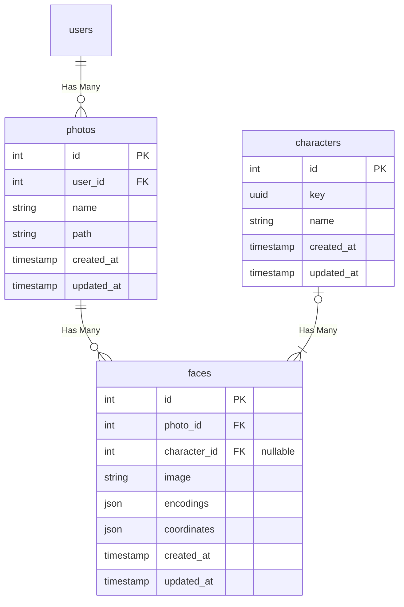

# Foto
Self host google photo like service.


## Setup laravel
```bash
$ cd panel && \
  composer install && \
  php artisan key:generate
```

## Setup python libraries
Before instll python libraries you need to install `dlib` library which you can see in this [link](https://gist.github.com/ageitgey/629d75c1baac34dfa5ca2a1928a7aeaf).
```bash
$ cd vision && \
  python -m venv .venv && \
  source .venv/bin/activate && \
  .venv/bin/python -m pip install -r requirements.txt
```

## Database Diagram
